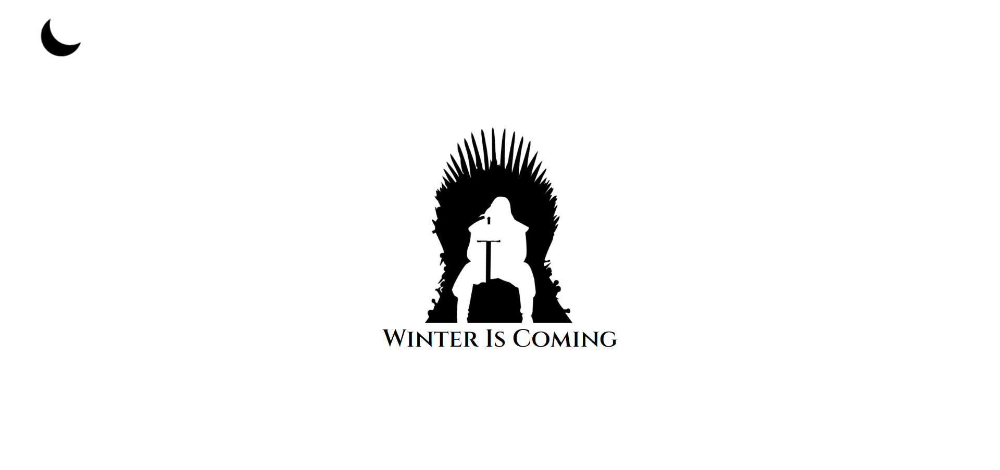
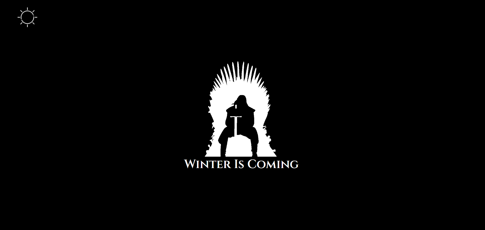

# Dark Mode

Desenvolvido para aprendizado, realizado durante aula de CSS na plataforma da Alura. A funcionalidade do Modo Noturno é trocar as cores das imagens e textos. 01/12/2022

[🔗 Clique aqui para acessar] (https://michel-maia.github.io/Dark-Mode/)

## 💻 Tecnologias

- HTML
- CSS
- Javascript

## Referência

- [Alura] https://www.alura.com.br/escola-front-end